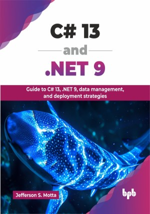

# C# 13 and .NET 9

Guide to C# 13, .NET 9, data management, and deployment strategies.

This is the repository for [C# 13 and .NET 9
](https://bpbonline.com/products/c-13-and-net-9?variant=44661110964424),published by BPB Publications.

## About the Book
C# and .NET continue to evolve as powerful, versatile tools for building modern applications, driving innovation across various platforms. This book focuses on the latest advancements, empowering you to develop robust and high-performing software solutions.

The book leads you from setting up your development environment and understanding C# fundamentals, including new C# 13 language features, to mastering object-oriented programming with classes, inheritance, and interfaces. You will then learn to utilize the extensive .NET framework's base class library, handling file I/O, and efficiently managing data with Entity Framework Core and LINQ. Finally, you will learn modern web development with ASP.NET Core, exploring Razor Pages, MVC, RESTful APIs, and Blazor for interactive UIs, before learning crucial packaging and deployment strategies.

By the end of this book, you will have a strong command of C# 13 and .NET 9, empowering you to design, develop, and deploy a wide range of modern, cross-platform applications with the latest tools and best practices.

## What You Will Learn
• New language features of C# 13.

• Build cross-platform applications for Windows, Mac, and Linux.

• Design scalable web applications with ASP.NET Core.

• Leverage Entity Framework and LINQ for data.

• Create interactive web UIs using Blazor.

• Implement professional development workflows in Visual Studio.
